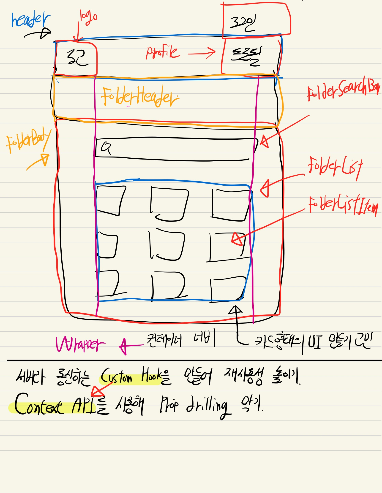

# 코드잇 7주차 미션

### TMI

코드잇 7주차 미션을 진행하면서 많은 고민을 해보면서 만들었다.
어떻게 해야 코드를 이쁘게(?) 만들 수 있는지와 폴더 구조를 어떤 식으로 짜는게 좋을지가 가장 큰 고민이다.
내가 이런 생각을 하게된 이유는, 개발 지망생이라면 기본적으로 구현은 다 할 줄 안다. 하지만 코드는 개발하는 사람의 생각이 들어가기 때문에 고민해서 만든 코드인지 아닌지의 차이가 있다고 생각한다.
내가 남들과 다르려면 내 생각이 들어간 코드를 작성하는게 좋겠다 라고 판단을 했다.

### 그래서 어떻게 만들었나

나도 배우고있는 스프린터이기 때문에 내가 잘 했는지는 모르겠지만 가장 중요하게 생각하는건 관심사 분리다.
우선 디자인 시안이 하나라서 어떤식으로 할까 고민을하다가, 페이지별로 폴더를 만들고 거기서 많이 분리하기로 했다.
한번 아이패드로 끄적여봤다.

[2월 5일에 만든것이라 현재 구조와 다르다. 지금은 folder라는 이름을 share로 바꿨다.]

아이패드로 그림을 그려보면서 컴포넌트의 이름들은 어떻게 지어줄지, 고민을 하니까 생각보다 쉽게 해결이 되었다. (이게 맞는지 잘 모르겠다.)
앞으로 검색바를 다른곳에서 재사용할지 모르기 때문에 folder에 넣어버렸다. 안그러면 확장 가능성을 너무 생각하게 되다보니 여러개의 Props를 전달해줄 수 밖에 없다.
컴포넌트들은 이렇게 쪼개면 된다고 생각을했고, 커스텀 훅과 상태관리를 사용해 Prop drilling을 안하면 베스트일거라고 생각했다.

### assets 폴더

- fonts => 폰트는 로컬로 저장해서 사용했다. 왜냐하면 CDN 방식보다 더 빠르고 제공해주는 서비스가 망한다면! 해당 서비스의 폰트도 사용할 수 없기 때문이다.
- images => 이미지와 아이콘을 관리하는 폴더

### Components 폴더

- folder => foler 페이지와 관련된 것들을 잘게잘게 쪼개놓았다. (folderHeader, folderBody)
- header => 웹 사이트의 header를 담당하는 폴더
- layout => 규격화된 사이즈 즉 컨테이너 폭(그리드 폭)을 지정하는 폴더
- UI => 재사용성이 높은 폴더 (Loading 컴포넌트, 추후에 Button 컴포넌트 같은 것들 생길 예정)

### hooks

- 심화 요구 사항이라 커스텀 훅을 한번만 사용해서 Http 요청과 상태를 만든 폴더.

### utils

- 필요한 것들을 어디서나 사용할 수 있도록 도와주는 폴더

### context

- 굳이 쓸 필요는 없었지만 공부할겸, 상태관리를 하는 context 폴더

나름 이렇게 분리를 해보았지만, 잘 한건지는 멘토님한테 피드백을 받아봐야 알 듯하다.
함수형 프로그래밍에서는 하나의 함수가 한가지의 일만 할 수 있도록 하는데, 이게 정말 쉽지않다.
스스로 코드와 타협을 하게되는것이 가장 큰 문제점이라고 생각한다.

컴포넌트도 하나의 UI만 보여주는게 맞다고하는데, 리액트로 넘어오면서 컴포넌트 분리가 가장 힘든것 같다. (개발자 생각에 따라 너무 다르게 만들 수 있음)
